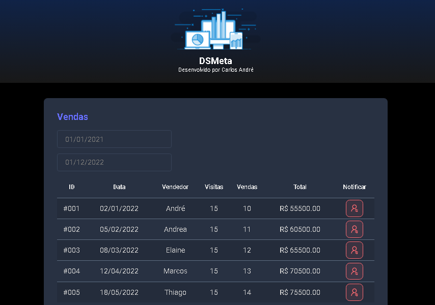

<h1 align="center">DSMeta</h1>

Projeto Front-end desenvolvido durante a semana Spring React promovida pelo professor Dr. Nélio Alves da escola de programação <a href="https://devsuperior.com.br/cursos" target="_blank">DevSuperior</a>.

  <a href="#-tecnologias">Tecnologias</a>&nbsp;&nbsp;&nbsp;|&nbsp;&nbsp;&nbsp;
  <a href="#-conceitos">Conceitos</a>&nbsp;&nbsp;&nbsp;|&nbsp;&nbsp;&nbsp;
  <a href="#-layout">Layout</a>&nbsp;&nbsp;&nbsp;|&nbsp;&nbsp;&nbsp;
  <a href="#-licença">Licença</a>

 

  

## 🚀 Tecnologias

Esse projeto utiliza as seguintes tecnologias:

* *HTML e CSS*
* *Figma*
* *Git e GitHub*

## 📑 Conceitos

Estes foram alguns assuntos abordados durante o desenvolvimento do projeto:

* *HTML Semântico, Estrutura do projeto, Box Model*
* *Flexbox, Acessibilidade, Git e GitHub*
* *Tabelas, dentre outros...*

## 📐 Layout

Você pode visualizar o layout do projeto através [*desse link*](https://www.figma.com/file/EN1zFtk4eY3Jgmpgi9YaMG/DSMeta1?node-id=0%3A1&t=8UsJJYHBkCvRZJWT-0). É necessário ter conta no [*Figma*](https://figma.com) para acessá-lo.

## ✒️ Licença

Esse projeto está sob a licença MIT.

---

*Feito com* ❤️ *por* [*Carlos André.*](https://github.com/andresoftdev)